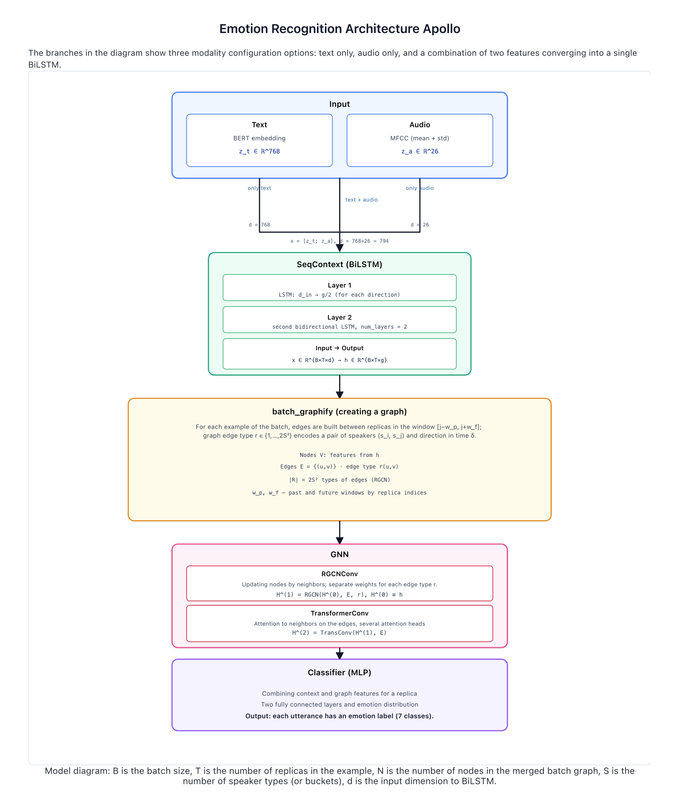
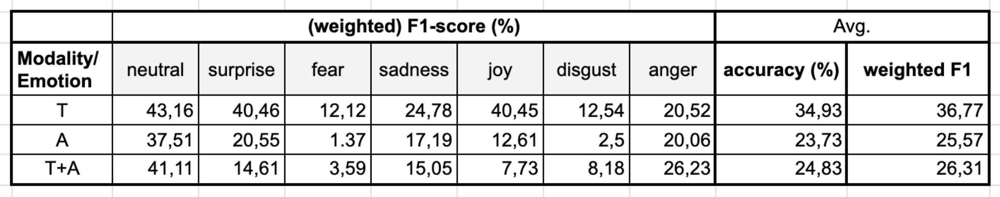

# Apollo
### Решаемая задача
Для каждой реплики диалога требуется предсказать дискретную эмоцию из фиксированного множества классов.   

### Архитектура 
1. Модель распознавания эмоций в диалогах использует мультимодальные признаки — текстовые (768 размерностей) и акустические (26 размерностей) с возможностью обработки только текста, только аудио или их комбинации.  
2. Входные признаки сначала проходят через двухслойный BiLSTM, который кодирует контекст до и после каждой реплики, формируя выход размерности 200.  
3. Далее контекстные представления подаются в графовую нейросеть (RGCNConv + TransformerConv + BatchNorm + LeakyReLU), которая учитывает связи между репликами и спикерами, с количеством отношений, равным 2 × число спикеров².  
4. На выходе графовой сети работает MLP-классификатор с скрытым слоем размерности 100 и функцией потерь CrossEntropyLoss, присваивающий каждой реплике эмоциональный лейбл.

### Результаты

