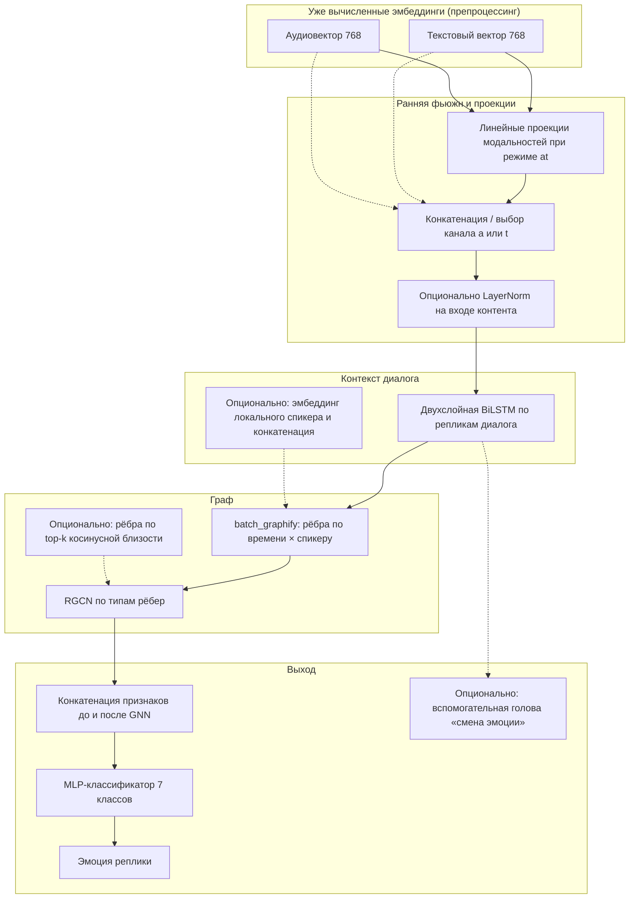

# Отчёт по дипломному проекту  
## Многомодальная классификация эмоций в диалогах на базе модели Apollo (датасет MELD)

**Объём:** ~5–6 страниц текста при шрифте 14 pt и межстрочном интервале 1,5  
**Файл:** версия для последующей вёрстки в Word/LaTeX (таблицы и схемы можно перенести как есть)

---

## 1. Введение и постановка задачи

Распознавание эмоций в речи и тексте является активной областью исследований с приложениями к диалоговым системам, анализу пользовательского опыта и социальному NLP. Датасет **MELD** (Multimodal EmotionLines Dataset) задаёт типичную постановку: для каждой **реплики** в сериальном диалоге известна метка одной из семи категорий эмоций (*neutral*, *surprise*, *fear*, *sadness*, *joy*, *disgust*, *anger*), при этом доступны **транскрипт** и **фрагмент аудио** соответствующей реплики.

Цель разрабатываемого решения — построить **конечную модель**, которая по признакам текста и аудио предсказывает класс эмоции на уровне реплики, используя **контекст диалога** (предшествующие и последующие высказывания) через явное моделирование структуры диалога графом. В работе реализован и экспериментально проверен пайплайн: извлечение устойчивых эмбеддингов из двух модальностей → контекстное кодирование → **графовая нейронная сеть** → классификация. Отдельное внимание уделено **качеству препроцессинга** (корректная подготовка текста для трансформеров, robust-пайплайн для аудио) и **абляции по модальностям** (только аудио / только текст / аудио+текст).

Ниже изложены идея метода, этапы препроцессинга, архитектура модели Apollo, протокол обучения и полученные на тестовой выборке результаты с интерпретацией.

---

## 2. Идея предлагаемого решения

Ключевая идея состоит в разделении задачи на три уровня:

1. **Извлечение признаков модальностей.** Текст и аудио представляются компактными векторами фиксированной размерности с помощью предобученных нейросетевых энкодеров; для повышения инвариантности к домену диалогов телевизионного сериала энкодеры **дообучаются** на разметке MELD (отдельно текстовая и аудиоветка).

2. **Раннее объединение модальностей и временное кодирование.** Векторы модальностей объединяются **конкатенацией** (early fusion) и подаются в двунаправленную рекуррентную сеть (BiLSTM), которая формирует контекстное представление каждой реплики внутри диалога с учётом локального временного порядка.

3. **Граф над репликами диалога и классификация.** Для каждого диалога строится **ориентированный помеченный граф**, узлы которого соответствуют репликам, а рёбра кодируют тип связи (направление во времени и принадлежность тому же или другому говорящему). По узлам применяется **реляционная свёрточная сеть (RGCN)**, после чего признаки узлов объединяются и подаются в классификатор эмоций.

Такой дизайн следует идее **коммуникационного контекста**: решение по эмоции текущей реплики опирается не только на её локальный текст и голос, но и на соседние высказывания и роли спикеров — без явного разбиения на сложные иерархические подзадачи.

Дополнительно в архитектурный каркас заложены опции: добавление **рёбер по косинусной близости** скрытых представлений внутри диалога (расширение типов отношений в RGCN), вспомогательная потеря на предсказание **факта смены эмоции** относительно предыдущей реплики, эмбеддинг локального идентификатора спикера. В базовом экспериментальном прогоне с абляцией по модальностям часть этих усилений может быть отключена для чистоты сравнения; наличие опций фиксирует траекторию улучшений для последующих работ.

---

## 3. Препроцессинг данных

**Зачем вообще препроцессинг.** Модель Apollo на входе не читает «сырой» CSV и wav-файлы напрямую на каждой эпохе (это было бы слишком медленно и нестабильно). Заранее для **каждой реплики** в датасете MELD считаются **числовые признаки**: компактный вектор текста и компактный вектор аудио одинаковой размерности (**768 чисел** каждый), плюс служебные поля (метка эмоции, номер диалога, спикер, время начала/конца, пауза). Результат сохраняется в файл **`samples.pkl`**. Дальше обучение Apollo многократно подгружает уже готовые векторы — это и есть смысл препроцессинга.

**Общая схема «от строки датасета к pickle».**

1. Прочитать таблицу MELD и для каждой строки найти соответствующий **wav**-файл реплики.  
2. Подготовить **текст** и прогнать его через текстовую нейросеть → получить вектор длины 768.  
3. Загрузить **звук**, привести к одному формату (16 кГц, моно), прогнать через **Wav2Vec2** → снова вектор длины 768.  
4. Выполнить **построчную L2-нормализацию** текстового и аудиовектора перед сохранением (см. п. 3.3), чтобы каналы не расходились по масштабу чисел только из-за особенностей энкодеров.  
5. Для всех реплик одного диалога посчитать **паузы** между соседними репликами.  
6. Разбить всё множество диалогов на **train / dev / test** так, чтобы **один и тот же диалог** целиком попал только в одну часть — иначе модель «подсмотрит» соседние фразы между выборками.

Ниже каждый шаг расписан проще, без предположения, что читатель уже знаком с деталями трансформеров.

### 3.1. Текст: что именно подаём в модель и почему не «чистим до корней»

**Что берём из датасета.** Для реплики есть фраза на английском — это и есть исходный текст.

**Минимальная очистка.** Строка приводится к единому виду Unicode и лишние пробелы убираются. **Специально не делается** то, что часто делают для старых методов: не выкидывают знаки препинания, не приводят всё к базовым формам слов (лемматизация), не выкидывают «стоп-слова». Причина простая: текст кодирует **нейросеть-трансформер**, которая уже училась на естественных предложениях с пунктуацией и живым порядком слов. Если «разобрать» фразу как для классического мешка слов, признаки становятся беднее, а распределение входов перестаёт совпадать с тем, под что модель обучалась — качество обычно **падает**.

**Как получается один вектор из целой фразы.**

1. Токенизатор разбивает текст на **кусочки** (субслова). Длинные реплики не обрезаются агрессивно: допускается до **256** таких кусочков — этого достаточно для типичных реплик в MELD.  
2. Трансформер (**MPNet** или совместимая архитектура) для каждого кусочка выдаёт числовое представление.  
3. Чтобы снова получить **один** фиксированный вектор на всю реплику, берётся **усреднение** представлений по всем кусочкам с учётом «настоящих» слов и игнора паддинга (простыми словами: *больший вклад дают не служебные добавки до длины батча*).

**Два этапа по времени (удобно для практики).**

- Сначала можно один раз собрать pickle с **готовой общей** текстовой моделью (sentence-transformers **all-mpnet-base-v2**), если дообученный MPNet ещё не обучен.  
- Затем отдельно дообучить **MPNet под семь эмоций MELD** на train-разметке (`microsoft/mpnet-base` как типичная отправная точка) и **ещё раз** прогнать препроцессинг уже с этими весами. Так текстовые признаки становятся ближе к домену сериала и к самой задаче классификации.

### 3.2. Аудио: загрузка, громкость и нейросеть для звука

**Что подаём.** Из файла реплики загружается акустический сигнал. Он приводится к **16 кГц** и **одному каналу (моно)** — это стандарт для многих речевых моделей. Затем выполняется **нормализация громкости по пику**: это не «улучшение качества записи», а способ не дать очень тихим или очень громким клипам автоматически перевешивать обучение только из-за амплитуды.

**Как получается вектор из звука.** Используется семейство моделей **Wav2Vec2**. Она на входе получает сырой звук как последовательность отсчётов и на выходе даёт последовательность скрытых состояний по времени. Чтобы получить **один вектор на реплику**, эти состояния **усредняются по времени** (с учётом маски, если в батче есть дополнение нулями — усредняются только «реальные» отсчёты).

**Какую именно Wav2Vec2 брать.** В работе по умолчанию используется публичная модель **`facebook/wav2vec2-base-960h`** — она уже дополнительно «подкручена» на большом объёме речи по сравнению с самым коротким базовым вариантом, поэтому часто даёт более информативные признаки для последующей задачи.

**Зачем отдельно дообучать аудиомодель.** Общая Wav2Vec2 училась в основном на распознавании речи, а не на эмоциях. Поэтому на неё навешивается небольшая **классифицирующая голова** и проводится дообучение на семи классах на тех же train/dev, что и основная модель Apollo. После этого при финальном препроцессинге из дообученной сети берётся не голова «эмоция», а **внутренний кодировщик звука** — один на всю реплику вектор того же размера **768**, чтобы Apollo сама решала, как смешивать текст и аудио.

**Короткие реплики.** У очень коротких фраз звук по длительности малый; после внутренних свёрток Wav2Vec2 временная сетка становится очень короткой. При дообучении это может ломать маски аугментации (**SpecAugment** по времени и частоте) и обучение. Поэтому при необходимости сигнал **дополняется тишиной (нулями)** хотя бы до порядка **половины секунды** — не чтобы «раздуть» содержание, а чтобы численный пайплайн оставался устойчивым; вероятности таких масок при необходимости **обнуляются**, чтобы не получались бессмысленные маски на двух-трёх шагах. При проблемах ускорителя (например, нестабильные значения потерь на **MPS** у Apple Silicon) дообучение аудиоголовы иногда выполняют на **CPU**: медленнее, но предсказуемее.

**Длинные реплики при кодировании признаков.** Чтобы не переполнять память GPU при пакетной обработке, при расчёте эмбеддингов для pickle аудио **обрезается по первым 30 секундам** (верхний предел в энкодере препроцессинга). Для типичных коротких реплик MELD это почти никогда не срабатывает.

### 3.3. Зачем делить вектор на его длину (L2-нормализация)

После того как получены текстовый и аудиовектор, каждый из них **приводится к единичной длине** в смысле евклидовой нормы (если вектор не нулевой). Интуитивно: мы не меняем «направление» признака в пространстве, а только убираем ситуацию, когда один канал систематически в **несколько раз крупнее по числам** другого только из-за особенностей энкодера. Иначе следующие линейные слои в Apollo могли бы непроизвольно «слушать» только более «громкий» канал. Это делается **на этапе сохранения данных**, до основного обучения графовой модели.

### 3.4. Пауза между репликами и честное разбиение выборки

**Пауза.** Для каждой реплики известны время начала и конца внутри эпизода. По ним для всех реплик одного диалога считается **сколько секунд паузы до следующей реплики**. У последней реплики пауза считается нулевой. Этот скаляр может использоваться моделью как дополнительный вход (после логарифмирования и нормализации по среднему и разбросу **только на train** — чтобы параметры нормализации не подсматривали dev/test).

**Разбиение train/dev/test.** Разрез делается не по отдельным фразам, а по **dialogue_id**: все реплики одного диалога попадают в одну и ту же часть данных. Если бы соседние реплики одного разговора оказались и в обучении, и в тесте, оценка качества была бы завышена — модель могла бы опираться на почти дословное «продолжение», уже виденное в обучении.

Итог препроцессинга — **единый файл pickle** с тысячами объектов «реплика»: текстовый вектор, аудиовектор, метка, диалог, спикер, паузы и параметры нормализации паузы для воспроизводимости.

---

## 4. Схема архитектуры метода (Apollo)

Ниже приведена логическая блок-схема потока данных (от модальностей до предсказания класса).

**Пояснения к блокам.**

- **Проекции и размерность входа.** В режиме «только текст» или «только аудио» на вход BiLSTM подаётся один канал размерности энкодера (768). В режиме **at** обе модальности проецируются в общее пространство (например, 320 измерений каждая) и конкатенируются; опционально добавляется скаляр нормализованной паузы.

- **BiLSTM.** Формирует последовательность скрытых состояний по репликам внутри батча диалогов; учитывает упаковку переменной длины диалогов (`pack_padded_sequence`), что критично для корректной работы на ускорителях (в т.ч. корректное размещение длин на CPU при использовании MPS/CUDA).

- **Граф.** Узлы — реплики; типы рёбер соответствуют комбинации направления во времени и совпадения говорящего. Такая схема согласуется с подходами типа DialogueRNN / COGMEN по учёту межличностной структуры, но реализована в виде явного RGCN-слоя над статически построенным графом.

- **Классификатор.** Для каждой реплики берётся вектор признаков после графовой обработки (и при стандартной конфигурации — конкатенация с исходным контекстным признаком до GNN), затем полносвязные слои с dropout выдают логиты семи классов.

Архитектура тем самым совмещает **раннюю мультимодальную интеграцию**, **рекуррентное временное сглаживание** и **структурное обобщение через GNN** в одном сквозном графе вычислений.

---

## 5. Обучение

### 5.1. Функция потерь и баланс классов

Распределение классов в MELD сильно перекошено (преобладает *neutral*). В базовой конфигурации используется **взвешенная cross-entropy** с весами классов по схеме effective number (**β ≈ 0.999**) либо опционально равные веса для экспериментов с максимизацией raw accuracy. Поддерживается также **focal loss** с параметром γ как альтернатива для акцента на трудных примерах.

### 5.2. Оптимизация и регуляризация

Оптимизатор — **AdamW** с типичным для трансформерного fine-tuning порядка величины learning rate **2·10⁻⁴**, клиппинг градиента, weight decay. Обучение идёт батчами **диалогов** (не изолированных реплик), что согласовано с графовой частью модели.

### 5.3. Выбор гиперпараметров и остановка

Для сравнения модальностей проведён единый протокол: до **100 эпох** с **early stopping** по отсутствию улучшения выбранной метрики на dev (например, patience **15** эпох при мониторинге **weighted F1**). Лучшие веса сохраняются по метрике на dev; на тесте отчёт формируется один раз после выбора модели.

Отдельно отмечается, что при желании повысить качество на редких классах может использоваться **дублирование диалогов** в обучении, содержащих редкие эмоции (настраиваемый список классов и коэффициент повторения).

---

## 6. Результаты экспериментов

Эксперименты выполнялись на одинаковых сплитах и одном и том же препроцессированном `samples.pkl` после дообучения текстового и аудио энкодеров на MELD. Для трёх конфигураций (**только аудио — a**, **только текст — t**, **аудио+текст — at**) оценивались **accuracy**, **macro F1**, **weighted F1** и поклассовые **precision / recall / F1** на тестовой выборке.

### 6.1. Сводные метрики (test)

| Модальность | Accuracy | Weighted F1 |
|-------------|----------|-------------|
| a (audio)   | 0,445    | 0,282       |
| t (text)    | 0,601    | 0,604       |
| at          | **0,611**| **0,608**   |

Мультимодальный режим **at** даёт **наибольшую** точность и weighted F1; прирост относительно только текста небольший (+~1 п.п. по accuracy), но систематический.

### 6.2. Поклассовый анализ

Для **текста** и **мультимодальности** наблюдаются устойчивые ненулевые значения F1 по большинству классов; лучше всего модели удерживают классы с большим числом примеров (*neutral*, *joy*, *surprise*). Для **редких классов** (*fear*, *disgust*) сохраняется низкий абсолютный F1 — типичная проблема для дисбаланса и коротких аудиосегментов.

Интересный эффект для конфигурации **только аудио**: модель частично «схлопывается» к доминирующему классу *neutral* (очень высокая полнота при умеренной точности по нему), что резко ухудшает macro F1 и интерпретируется как **нехватка различимой аудиоинформации** без текстового канала при текущей архитектуре и объёме данных.

Приведём показатели для режима **at** (фрагмент полной таблицы из отчёта автоматической оценки):

| Эмоция   | Precision | Recall | F1    |
|----------|-----------|--------|-------|
| neutral  | 0,737     | 0,780  | 0,758 |
| surprise | 0,576     | 0,644  | 0,608 |
| fear     | 0,206     | 0,351  | 0,260 |
| sadness  | 0,378     | 0,298  | 0,333 |
| joy      | 0,611     | 0,527  | 0,566 |
| disgust  | 0,204     | 0,292  | 0,241 |
| anger    | 0,482     | 0,391  | 0,432 |

Полные таблицы по всем трём режимам зафиксированы в проекте в файле `results/apollo_meld_suite_emotion_table.md` и могут быть включены в приложение к диплому.

---

## 7. Демонстрационное веб-приложение Eleos

Для наглядной демонстрации работы обученной модели и проверки **сквозного конвейера** «текст диалога → признаки → Apollo → эмоции по репликам» разработано локальное веб-приложение **Eleos**. Оно не заменяет полноценный продакшен-сервис, но закрывает практическую задачу дипломного проекта: показать интерпретируемый результат классификации на **многосторонних диалогах** в удобном для человека виде.

**Назначение и аудитория.** Инструмент ориентирован на специалистов, которым важна **эмоциональная динамика** разговора, а не только итоговая метрика на тесте: психологи и исследователи коммуникации могут быстро просмотреть последовательность эмоциональных окрасов; менеджеры по качеству обслуживания — отметить эпизоды напряжения или позитивного отклика в переписке; сценаристы и редакторы диалогов — увидеть «ритм» эмоций по репликам при наборе сцены. Семь классов MELD (*neutral*, *surprise*, *fear*, *sadness*, *joy*, *disgust*, *anger*) задают общий язык описания; в интерфейсе каждому классу сопоставлен свой цвет, что снижает порог восприятия по сравнению с сухим табличным выводом.

**Технологический контур.** Клиентская часть — одностраничный интерфейс на **HTML/CSS/JavaScript** (статические файлы в каталоге `front/`). Сервер реализован на **FastAPI** и поднимается локально командой `PYTHONPATH=back uvicorn app.main:app` из корня репозитория (по умолчанию порт **8765**, хост **127.0.0.1**). При старте приложения выполняется **ленивая загрузка** чекпоинта Apollo (переменная окружения `APOLLO_CHECKPOINT`, иначе путь по умолчанию в `results/.../model.pt`) и инициализация **SentenceTransformer** для получения текстовых эмбеддингов реплик в том же векторном пространстве, что использовалось при препроцессинге. Запрос анализа обрабатывается эндпоинтом `POST /api/analyze`; состояние сервера и сведения о чекпоинте доступны по `GET /api/status` (наличие модели, устройство вычислений, текст ошибки загрузки). Таким образом, веб-слой отделён от ядра ML: интерфейс отвечает за ввод и визуализацию, а модуль `back/app/inference.py` — за сборку батча в формат `Dataset` и инференс в **PyTorch**.

**Поток данных и ограничения демо.** В браузере пользователь задаёт число участников (до 32), добавляет реплики с привязкой к индексу говорящего и запускает анализ. Для каждой реплики вычисляется вектор признака текста; для чекпоинтов с модальностью **«только текст»** аудиоканал в объекте `Sample` заполняется нулём и не участвует в признаке. Для конфигурации **«аудио+текст»** в демо-режиме без микрофона в коде инференса используется **прокси аудиопризнака** (копия текстового эмбеддинга той же реплики), что позволяет прогнать граф **без записи звука**, но не эквивалентно эксперименту на полном мультимодальном MELD; это важно явно указать в пояснительной записке как ограничение демонстрационной постановки. Паузы между репликами в демо задаются упрощённо (фиктивные временные метки); нормализация паузы при наличии `use_pause` в чекпоинте опирается на статистики из обучающего `samples.pkl`, если файл доступен.

**Визуализация результатов.** После ответа API интерфейс строит **временную цепочку реплик** в виде SVG-графа: узлы соответствуют высказываниям, цвет узла кодирует предсказанную эмоцию, подпись или маркер отражает спикера. Рядом с каждой репликой отображаются текст, метка класса и (при наличии) **уверенность** предсказания. Дополнительно формируется **сводка по спикерам**: доли «позитивных», «негативных» и «нейтральных» тонов (агрегация семи классов в три группы: *joy*; *anger*, *disgust*, *fear*, *sadness*; *neutral* и *surprise*) и процентное распределение по всем семи эмоциям для каждого участника. Это помогает ответить не только на вопрос «какая эмоция у данной фразы?», но и на вопрос «как распределён эмоциональный фон речи каждого персонажа в отрывке».

**Обмен данными.** Поддерживается **импорт и экспорт** диалога в JSON со схемой `eleos-dialogue-v1`: удобно сохранить сцену, передать её коллеге или верифицировать тот же диалог после смены чекпоинта. Такой формат упрощает повторяемость демонстрации на защите и документирование примеров.

**Конфиденциальность и развёртывание.** Приложение рассчитано на **локальный** запуск: данные диалога не покидают машину пользователя, если не настроена иная схема проксирования. Это снижает риски утечки персональных или деловых переписок при демонстрации метода.

### 7.1. Функциональные требования

Функциональные требования к системе сведены в таблицу 7.1.

**Таблица 7.1 — Функциональные требования к веб-приложению**

| Требование | Описание |
|------------|----------|
| Ввод диалога вручную | Пользователь формирует многосторонний диалог в браузере: для каждой реплики задаётся текст и индекс говорящего в диапазоне `0 … N−1`, где `N` — число участников. |
| Импорт из файла | Пользователь может **загрузить JSON** с диалогом (формат `eleos-dialogue-v1`), чтобы не вводить длинные сцены вручную. |
| Валидация входа | Перед вызовом модели проверяется непустой текст реплик, согласованность индексов спикеров с заявленным `N`, корректность структуры импортируемого JSON; при ошибке пользователь получает понятное сообщение. |
| Анализ эмоций | Система передаёт реплики в пайплайн инференса Apollo: вычисление эмбеддингов (Sentence Transformers), сборка батча, прямой проход нейросети. |
| Вывод по репликам | Для каждой реплики возвращаются **имя класса эмоции**, идентификатор класса, при необходимости **достоверность** (максимум softmax по логитам). |
| Визуализация | Результат отображается как структурированный диалог с **цветовой подсветкой** узлов/реплик в соответствии с классом; выводится текст реплики и спикер. |
| Легенда | Интерфейс содержит **легенду эмоций**: соответствие цветов семи категориям MELD. |
| Статус системы | Отображается готовность модели, путь к чекпоинту, устройство вычислений; при сбое загрузки весов показывается ошибка (например, отсутствие файла или несовпадение размерностей с чекпоинтом). |
| Экспорт | Пользователь может **скачать** текущий диалог в JSON для архивации или обмена. |

### 7.2. BPMN-описание основного процесса

Процесс взаимодействия пользователя с системой (аналог рисунка с BPMN в пояснительной записке) логически включает следующие этапы:

1. **Инициализация:** пользователь открывает страницу; клиент запрашивает `/api/status` и отображает, загружена ли модель.  
2. **Загрузка данных:** пользователь вводит реплики вручную или импортирует JSON.  
3. **Проверка корректности:** при нарушении ограничений (пустой текст, неверный спикер, битый JSON) процесс останавливается с сообщением об ошибке **без** вызова нейросети.  
4. **Инференс:** при успешной валидации клиент отправляет тело запроса на `POST /api/analyze`; сервер строит признаки и выполняет предсказание.  
5. **Отображение результата:** ответ отрисовывается как цветовая разметка диалога, граф реплик и блок статистики по спикерам; процесс для данного запроса завершён.

Такая схема соответствует типичному шаблону «ввод → валидация → обработка → вывод» и удобна для включения в главу с проектированием ИС.

### 7.3. Описание веб-интерфейса (экраны)

**Экран ввода** объединяет область «чата»: настройку числа участников, список реплик, поле ввода текста, выбор говорящего, кнопки «Добавить» и **«Отправить на анализ»**. В боковой панели «JSON» — выбор файла для импорта, кнопка выгрузки `dialogue.json`, превью текущего JSON и **легенда семи эмоций** с пояснением цветовой кодировки узлов и маркеров спикеров. В верхней части страницы выводится **статус загрузки чекпоинта** (готовность сервиса к работе).

**Экран результата** раскрывается после успешного анализа: отображается подсказка о числе реплик, **граф-временная линия** реплик с эмоциями и блок **сводки по участникам** — доли «хорошо / плохо / спокойно» (в терминах позитивный / негативный / нейтральный тон) и проценты по каждой из семи эмоций MELD. Так пользователь одновременно видит локальные предсказания и агрегированную картину по персонажам.

*Рекомендация для вёрстки диплома:* на рисунках приложения (аналог рис. «ввод» и «результат») следует зафиксировать реальные скриншоты Eleos с подписями полей и примером диалога из 6–10 реплик как минимум двух спикеров.

---

## 8. Выводы

1. Предложен **сквозной пайплайн** распознавания эмоций реплики в MELD: дообучаемые энкодеры текста и речи → ранняя мультимодальная конкатенация → BiLSTM по диалогу → **heterogeneous RGCN** на типизированном графе реплик → классификатор.

2. Показано, что **качество препроцессинга критично**: сохранение естественного текста для трансформеров, выбор устойчивого Wav2Vec2-чекпоинта, дообучение энкодеров на целевой разметке, нормализация эмбеддингов и аккуратная работа с короткими аудиофрагментами напрямую влияют на обучаемость аудиоветки.

3. Экспериментальное сравнение модальностей подтверждает ожидаемый тренд: **текст несёт основную информацию** для текущей постановки на MELD (**weighted F1 ≈ 0,604**), а добавление аудио в режиме **at** даёт **дополнительный прирост** (**weighted F1 ≈ 0,608**, accuracy **≈ 0,611**).

4. Конфигурация **только аудио** при том же графовом ядре демонстрирует **сильную деградацию** и практическую непригодность без дополнительных приёмов (расширенная аугментация, другие акустические признаки, более глубокое дообучение или изменение классификационной головы).

5. Архитектура содержит **расширяемые элементы** (similarity-рёбра в графе, вспомогательная потеря на смену эмоции, эмбеддинг спикера), что задаёт понятный план улучшений после базовой мультимодальной линии.

**Перспективы:** совместная оптимизация энкодеров с Apollo (end-to-end с заморозкой части слоёв), эксперименты с macro-F1 и стратегиями балансировки для редких классов, использование более мощных аудиомоделей при контроле вычислительных затрат, внешняя верификация на других корпусах диалоговой эмоциональной речи, а также расширение веб-демо полноценной загрузкой **аудио** на реплику для сопоставления с мультимодальным обучением без прокси-признаков.

---

*Конец текста отчёта (рекомендуется добавить титульный лист вуза, цели и задачи по методичке, список литературы по ГОСТ и приложения с полными таблицами метрик).*
